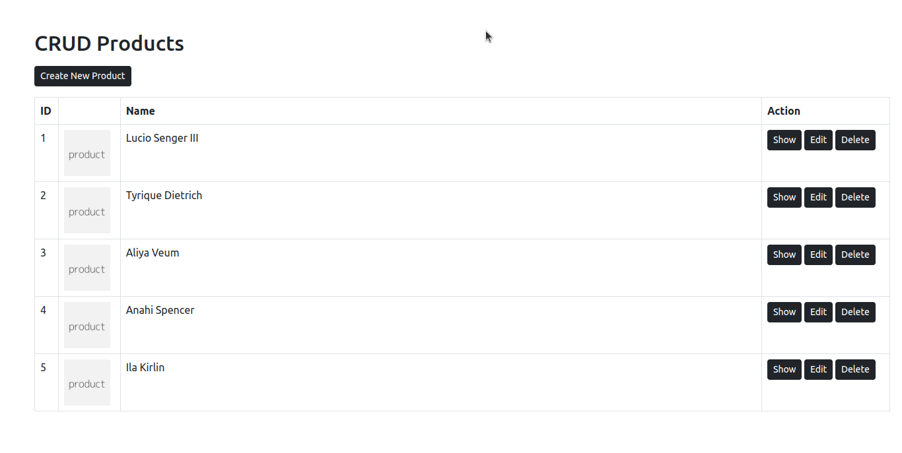
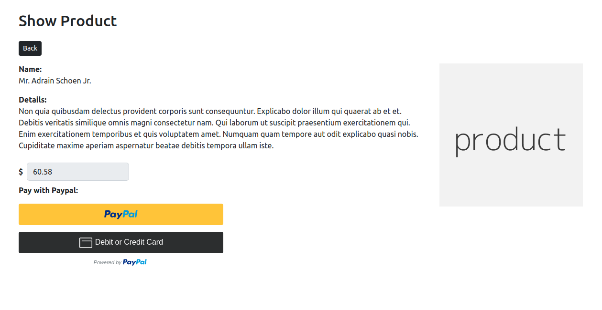

# CRUD APP

Laravel Sorting Products with Livewire Drag-Drop

---
## Screenshots




---

The following must be installed and available on your terminal:

* [x] composer
* [x] npm

---

## Starting Project


1. install laravel packs
```composer
composer install
```

2. install npm and run
```npm
npm install
```

Run the following command to generate your app key:

```
php artisan key:generate
```

Then start your server:

```
php artisan serve
```
----- 
Need helps? Reach me out

> Email: soulaimaneyahya1@gmail.com

> Linkedin: soulaimane-yahya

All the best :beer: